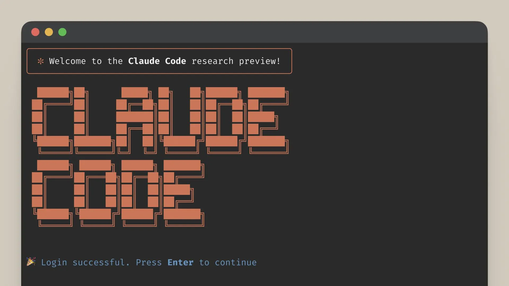
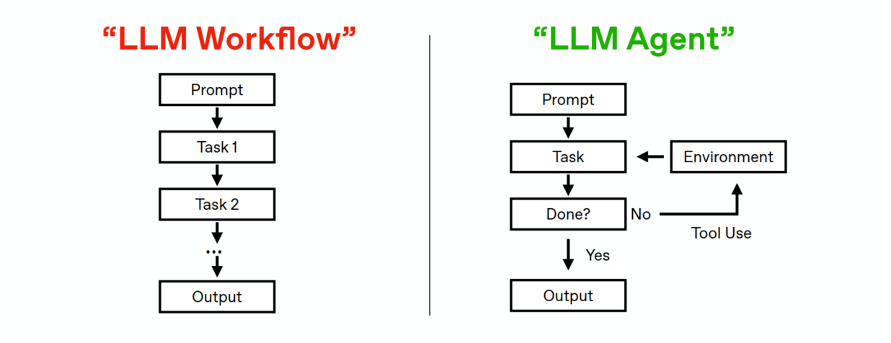

# Claude Code Foundations and Practical Guide



This document combines Claude Code foundations with two end-to-end practical tasks: reunning the assignment 1 with Claude Code Desktop and turning the assignment results into a personal portfolio website.

## 1. What is Claude Code?

Claude Code is an agentic coding environment from Anthropic for end-to-end software tasks: understanding a codebase, proposing and applying edits, running commands, and iterating with human approval ([official overview](https://code.claude.com/docs/en/overview)).

A useful way to think about it:
- Traditional AI coding assistants mostly complete or suggest code.
- Claude Code behaves more like a working agent loop: plan -> act with tools -> validate -> revise.

Compared with pure chat coding:
- It operates in real project context (files, folders, repo state).
- It supports permission gates and explicit review before changes.
- It is available across Desktop, Terminal CLI, IDE integrations, and web-oriented workflows.

Why this matters in analytics and product work:
- Faster implementation of data and automation tasks.
- More consistent debugging and project handoff notes.
- Better support for iterative, reviewable engineering workflows.

---

## 2. What is an AI Agent?

An AI coding agent is not just autocomplete. It typically loops through:
1. Understand the goal.
2. Build a plan.
3. Use tools (read files, run commands, edit code).
4. Check outputs and errors.
5. Iterate until completion (with human control).

Claude Code explicitly supports this mode with planning, permission control, and iterative execution patterns ([desktop docs](https://code.claude.com/docs/en/desktop), [overview](https://code.claude.com/docs/en/overview)).

Workflow vs Agent comparison diagram:



Interpretation:
- Left side (LLM Workflow) is mostly linear: prompt -> fixed task chain -> output.
- Right side (LLM Agent) adds environment feedback and tool use, with a completion check (Done?) before final output.
- Claude Code aligns more with the right-side pattern: iterative, tool-using, and context-aware.

---

## 3. Claude Code product forms: Desktop vs CLI vs IDE extension vs SDK/Headless

Claude Code runs across multiple surfaces that share a common core engine ([overview](https://code.claude.com/docs/en/overview)).

| Surface                           | Best use case                       | What it does well                                                                                                                             | Key limits                                                                                                       |
| --------------------------------- | ----------------------------------- | --------------------------------------------------------------------------------------------------------------------------------------------- | ---------------------------------------------------------------------------------------------------------------- |
| Desktop (Code tab)                | Visual, interactive coding sessions | Diff review UI, approvals, file attachments, low terminal friction ([desktop quickstart](https://code.claude.com/docs/en/desktop-quickstart)) | No Linux desktop app; less suited for heavy automation ([desktop docs](https://code.claude.com/docs/en/desktop)) |
| CLI                               | Automation, scripting, CI           | Pipe/print workflows, shell composability ([overview](https://code.claude.com/docs/en/overview))                                              | Requires terminal comfort                                                                                        |
| IDE extension (VS Code/JetBrains) | In-editor workflow continuity       | Works directly in editor context ([overview](https://code.claude.com/docs/en/overview))                                                       | Depends on extension/IDE setup                                                                                   |
| Agent SDK (Headless)              | Build custom agent systems          | Programmatic agent workflows in Python/TypeScript ([SDK](https://docs.anthropic.com/en/docs/claude-code/sdk))                                 | Requires API-key engineering setup                                                                               |

Desktop vs CLI highlights:
- Same core engine; shared config can include `CLAUDE.md`, MCP settings, hooks, and skills.
- Desktop is best for visual review and guided interaction.
- CLI is better for scripted, non-interactive, and pipeline-heavy flows.

---

## 4. What is CLI

`CLI` (Command Line Interface) means controlling tools through typed commands in a terminal.

Why it matters:
- Reproducibility: command history and scripts.
- Automation: repeatable tasks across datasets/repos.
- Deployment compatibility: cloud/SSH/CI systems are terminal-first.
- Auditability: easier to explain exactly what ran.

Terminal basics reference:
- On macOS use `Terminal`; on Windows use `PowerShell`.

| Command        | Meaning                   | What it does                                              |
| -------------- | ------------------------- | --------------------------------------------------------- |
| `pwd`          | Present Working Directory | Prints your current folder location ("where am I?").      |
| `cd <path>`    | Change directory          | Moves terminal location to `<path>`.                      |
| `ls`           | List                      | Shows files and folders in the current directory.         |
| `mkdir <name>` | Make directory            | Creates a new folder named `<name>`.                      |
| `rm <path>`    | Remove (be careful)       | Deletes a file/folder at `<path>`; use only after review. |

In this guide, CLI details are minimized; the practical flow is Desktop-first for students with limited command-line experience.

---

## 5. Other Coding Agents in 2026

Model availability can vary by plan, region, and release date. 

| Tool                                                                                                                                                                                               | Company            | Primary interface                | LLM (example models)                                                                                                                                           | Payment                                                                                                                                                                                                                                                                        |
| -------------------------------------------------------------------------------------------------------------------------------------------------------------------------------------------------- | ------------------ | -------------------------------- | -------------------------------------------------------------------------------------------------------------------------------------------------------------- | ------------------------------------------------------------------------------------------------------------------------------------------------------------------------------------------------------------------------------------------------------------------------------ |
| [GitHub Copilot](https://docs.github.com/en/copilot/get-started/what-is-github-copilot) + [Coding Agent](https://github.blog/news-insights/product-news/github-copilot-meet-the-new-coding-agent/) | GitHub (Microsoft) | IDE + GitHub                     | GPT-5 family, Claude family, Gemini family ([supported models](https://docs.github.com/copilot/using-github-copilot/ai-models/supported-ai-models-in-copilot)) | Free tier available; paid plans include Pro / Pro+ / Business / Enterprise ([plans](https://github.com/features/copilot/plans))                                                                                                                                                |
| [Cursor](https://docs.cursor.com/get-started/introduction)                                                                                                                                         | Anysphere          | AI code editor                   | GPT-5 family, Claude family, Gemini family ([models](https://docs.cursor.com/models))                                                                          | Hobby (free) plus Pro / Ultra / Teams / Enterprise ([pricing](https://cursor.com/pricing))                                                                                                                                                                                     |
| [Gemini CLI](https://google-gemini.github.io/gemini-cli/docs/)                                                                                                                                     | Google             | Terminal                         | Gemini family ([model docs](https://google-gemini.github.io/gemini-cli/docs/cli/model/))                                                                       | Free usage path with personal-account limits (for example, up to 60 requests/minute and 1,000 requests/day); paid usage via Gemini API/Vertex billing ([CLI docs](https://google-gemini.github.io/gemini-cli/docs/), [pricing](https://ai.google.dev/gemini-api/docs/pricing)) |
| [OpenAI Codex CLI](https://github.com/openai/codex)                                                                                                                                                | OpenAI             | Terminal (+ IDE/app/web options) | GPT family ([Codex repo](https://github.com/openai/codex), [OpenAI models](https://developers.openai.com/api/docs/models))                                     | Works with ChatGPT plans (Plus/Pro/Team/Edu/Enterprise) or API-key billing ([Codex repo](https://github.com/openai/codex), [plan note](https://help.openai.com/en/articles/11096431-using-codex-with-your-chatgpt-plan))                                                       |

---


## 6. Hands-on Part Overview

This part extends foundations into practical execution. You will complete one analytics task first, then turn that project plus your resume into a personal homepage.

Outcomes:
- Outcome A: Claude Code completes Assignment 1 workflow using the assignment prompt and dataset.
- Outcome B: Claude Code builds a personal homepage that combines your resume and Assignment 1 project content.

Required inputs:
- `Assg1_MSBA.pdf`
- `assg1.csv`
- Your resume file (`.md`, `.txt`, or `.pdf`)
- Your profile photo (`.jpg` or `.png`)

Environment policy:
- Desktop-first workflow.
- Ask Claude Code to propose a plan before execution.
- Use portable paths in prompts (`<COURSE_ROOT>`), plus one concrete Windows example.

Windows example `COURSE_ROOT`:
- `C:\Users\27497\Desktop\Courses\TA\Claude Code Teaching`

---

## 7. Practical Task 1: Run Assignment 1 end-to-end with Claude Code Desktop

This task demonstrates how to let Claude Code complete a real analytics assignment from prompt + data to final outputs.

### Step 1. Create the task workspace

`Goal`:
Create a clean folder structure for Task 1.

`Action`:
1. In File Explorer (or Finder), open your course root folder.
2. Create a new folder named `lab-assignment1`.
3. Inside `lab-assignment1`, create three subfolders: `inputs`, `outputs`, and `src`.

`What success looks like`:
`lab-assignment1/` contains `inputs/`, `outputs/`, and `src/`.

### Step 2. Add assignment files

`Goal`:
Put assignment instructions and dataset into the input folder.

`Action`:
1. Put `Assg1_MSBA.pdf` into `lab-assignment1/inputs/`.
2. Put `assg1.csv` into `lab-assignment1/inputs/`.

`What success looks like`:
`inputs/` contains both `Assg1_MSBA.pdf` and `assg1.csv`.

### Step 3. Open Claude Desktop and run the master prompt

`Goal`:
Open the correct project in safe mode and execute the assignment in one flow.

`Action`:
1. Open Claude Desktop and switch to `Code`.
2. Open folder: `<COURSE_ROOT>/lab-assignment1`.
3. Keep permission mode on `Ask permissions`.
4. Paste and run the master prompt below.
5. Review the plan that Claude returns first, then approve execution.

`What success looks like`:
The master prompt returns a concrete plan first, then Claude executes in reviewable steps after approval.

`Purpose`:
Run Assignment 1 in one-shot autonomous mode with clear constraints.

`Prompt text`:
```text
You are working in my local folder lab-assignment1.

Context files:
- inputs/Assg1_MSBA.pdf (assignment requirements)
- inputs/assg1.csv (dataset)

Task:
1) Read the PDF and infer the exact assignment requirements.
2) Inspect the CSV schema and data quality.
3) Detect available local runtime/tools and choose the safest runnable path.
4) Build reproducible analysis code under src/.
5) Run analysis and save outputs under outputs/.
6) Create outputs/summary.md with:
   - objective
   - method
   - key results
   - business interpretation
   - limitations and next steps
7) Before destructive actions (especially deleting files) or potentially paid/billable actions (for example API calls), stop and ask for explicit approval.

Process constraints:
- First show your plan.
- Then execute in small, reviewable steps.
- Use clear file names.
- End with a checklist of created files.
```

`Expected agent behavior`:
- Plan-first execution.
- Runnable code appears in `src/`.
- Outputs are saved in `outputs/`.
- `outputs/summary.md` explains both technical and business takeaways.

### Step 4. Verify outputs

`Goal`:
Confirm the task is complete and understandable.

`Action`:
Check the output folders and read the summary.

`What success looks like`:
- `inputs/` has the two Assignment 1 files.
- `src/` contains runnable analysis code or notebook.
- `outputs/` contains result artifacts.
- `outputs/summary.md` includes objective, method, key results, interpretation, and limitations.

---

## 8. Practical Task 2: Build a personal homepage from resume + Task 1 project

This task demonstrates how to convert analysis outputs into portfolio-ready storytelling with Claude Code.

### Step 1. Create website workspace

`Goal`:
Create a separate folder for website generation.

`Action`:
1. In File Explorer (or Finder), create a folder named `personal-site` under `<COURSE_ROOT>`.
2. Inside `personal-site`, create two subfolders: `inputs` and `website`.

`What success looks like`:
`personal-site/inputs/` and `personal-site/website/` exist.

### Step 2. Prepare website input materials

`Goal`:
Collect all content sources needed for webpage generation.

`Action`:
1. Copy your resume into `personal-site/inputs/`.
2. Copy your profile photo into `personal-site/inputs/`.
3. Copy `lab-assignment1/outputs/summary.md` into `personal-site/inputs/` and rename it to `task1-summary.md`.

`What success looks like`:
`inputs/` contains resume, photo, and `task1-summary.md`.

### Step 3. Add a website template (choose one)

`Goal`:
Choose a high-quality portfolio template and place it into `personal-site/website/`.

Template options (default + 5 extra high-star choices):

| Option  | Template              | Repository                                               | Notes                                                  |
| ------- | --------------------- | -------------------------------------------------------- | ------------------------------------------------------ |
| Default | StartBootstrap Resume | https://github.com/StartBootstrap/startbootstrap-resume  | Easiest for classroom pacing and fast customization.   |
| Extra 1 | simplefolio           | https://github.com/cobiwave/simplefolio                  | Modern look with strong community usage.               |
| Extra 2 | developerFolio        | https://github.com/saadpasta/developerFolio              | Strong project showcase design.                        |
| Extra 3 | DevPortfolio          | https://github.com/RyanFitzgerald/devportfolio           | Portfolio-focused layout with moderate setup overhead. |
| Extra 4 | academicpages         | https://github.com/academicpages/academicpages.github.io | Great for publication/project-heavy profiles.          |
| Extra 5 | al-folio              | https://github.com/alshedivat/al-folio                   | Polished academic/professional theme.                  |

`Action`:
1. Pick one template from the table.
2. Open that repository in your browser.
3. Click `Code` -> `Download ZIP`.
4. Unzip the downloaded file.
5. Copy the extracted template files into `personal-site/website/`.

`What success looks like`:
Your chosen template files are available in `website/`.

### Step 4. Run the master website prompt

`Purpose`:
Generate a personal homepage from resume + Task 1 outputs.

`Prompt text`:
```text
You are working in my local folder personal-site.

Inputs:
- inputs/<resume-file>
- inputs/<profile-photo>
- inputs/task1-summary.md

Website source:
- website/ (your selected template)

Task:
1) Read the resume and task1-summary.md.
2) Update the website with these sections:
   - About
   - Projects
   - Experience
   - Skills
   - Contact
3) In Projects, include Assignment 1 using only true findings from task1-summary.md.
4) Do not invent claims, metrics, or outcomes.
5) Keep layout mobile-friendly, readable, and professional.
6) Show planned edits before applying changes.
7) Apply edits in small batches and summarize each batch.
8) Run a final self-check:
   - broken links
   - missing image references
   - grammar
   - section completeness
9) Before destructive operations or potentially paid/billable actions, stop and ask for explicit approval.
```

`Expected agent behavior`:
- Plan-first edits with review checkpoints.
- Resume and project content integrated into one coherent homepage.
- Final QA summary is provided.

### Step 5. Iterate with follow-up prompts

`Goal`:
If you are not satisfied with the first draft, keep improving the result with targeted prompts.

`Action`:
1. Review Claude's current output and identify the biggest problems first.
2. Give one focused improvement prompt at a time (do not mix too many requests in one prompt).
3. Review each round of edits before approval.
4. Repeat until the website quality is good enough for your use case.

Use the three prompts below as references. You can (and should) also write your own targeted prompts based on Claude's actual output.

Reference prompt A: tighten storytelling
```text
Rewrite About, Experience, and Projects for a non-technical business audience.
Keep wording concise, concrete, and truthful.
```

Reference prompt B: improve project impact phrasing
```text
Improve the Assignment 1 project section by clarifying business value, assumptions, and practical implications.
Do not add any unsupported claim.
```

Reference prompt C: final QA
```text
Run final QA:
1) find broken links
2) verify image paths
3) check mobile readability
4) fix grammar and consistency
Then summarize all fixes.
```


### Step 6. Preview locally

`Goal`:
Open the generated site in a browser.

`Action`:
1. In Claude Desktop, give the following prompt:
   ```text
   Start a local preview server for the `personal-site/website` folder and tell me the URL.
   ```
2. Review and approve the action.
3. Open the returned local URL in your browser.

`What success looks like`:
The homepage loads and shows both resume content and Task 1 project content.

### Step 7. Publish to GitHub Pages

`Goal`:
Publish the generated website online.

`Action`:
1. In Claude Desktop, give the following prompt:
   ```text
   Publish `personal-site/website` to GitHub Pages end-to-end. First check my local Git and GitHub authentication status. If anything is missing, stop and tell me the minimum one-time action I must complete. If ready, proceed to publish and then return the final public URL plus a short deployment checklist.
   ```
2. Review Claude's plan and approve actions step by step.
3. Open the final URL returned by Claude and verify the site content.

`What success looks like`:
Claude returns a working GitHub Pages URL, and the online page matches your local preview.

Example output (for reference):
- TA's demo: https://wanglei123sjtu.github.io/claude-code-msba-student-guide/ 

---

## 9. Agent Usage Guidelines

This section gives some practical habits that help beginners use coding agents more safely and effectively.

### 9.1 Safety first

Be careful! Always review every agent action before approval, and be extremely careful with destructive actions (especially deleting files) and paid actions (for example, API calls that can incur charges).

### 9.2 How to get better results from agents

- Be specific in every prompt: include goal, relevant files, constraints, and expected output format.
- Give the agent a way to verify its work: ask it to run checks, compare outputs, and summarize pass/fail status.
- Use a plan-first workflow for complex tasks: explore -> plan -> implement -> verify.
- Keep edits small and reviewable: approve in batches, not in one large jump.
- Course-correct early and often: if output drifts, stop and restate requirements immediately.
- Manage context actively: very long sessions can reduce quality, so summarize progress and start a fresh session when needed.
- Do not over-trust model output: ask for assumptions, check calculations, and verify business claims yourself.

### 9.3 How to learn an agent's capability and limits

- Practice repeatedly with different task types (analysis, debugging, documentation, UI edits).
- Compare prompt quality and outcomes: vague prompts vs clear prompts.
- Track failure patterns (hallucinated facts, wrong assumptions, weak validation) and update your prompting style.
- Build your own "working prompt patterns" over time so later tasks are faster and more reliable.

**AI lowers the cost of execution. It doesn't lower the cost of thinking.**

---


## 10. References

- GitHub Pages: creating a site: https://docs.github.com/en/pages/getting-started-with-github-pages/creating-a-github-pages-site
- Best practices for Claude Code: https://code.claude.com/docs/en/best-practices
- Claude Code security: https://docs.anthropic.com/en/docs/claude-code/security
- Anthropic prompt engineering overview: https://docs.anthropic.com/en/docs/prompt-engineering


